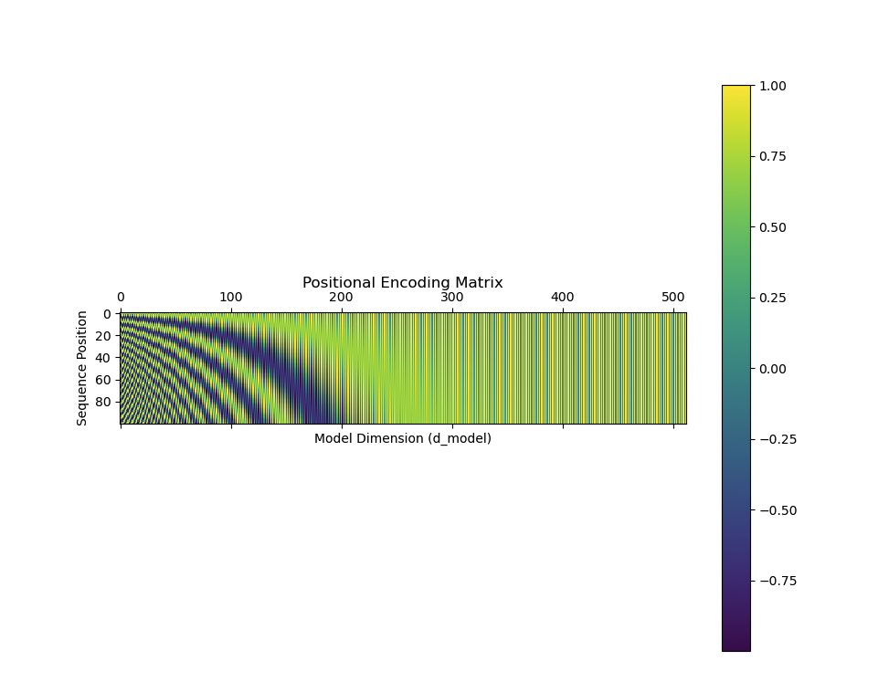

## Prompt Engineering template

### Basic

- A basic templated provides clarity, structure and consistency. This ensures the AI understands the task and delivers predictable, relevant responses. It reudces ambiguity and allows for customization to meet specific criteria.

```
[CONTEXT]
Background information and relevant details


[INSTRUCTION]
Specific task or request


[FORMAT]
Expected output format


[CONSTRAINTS]
Any limitations or requirements


[EXAMPLES]
Sample inputs and outputs if needed
```

Let's see the template in action below!

```
[CONTEXT]
A user wants to calculate the total cost of items in their shopping cart using Python.

[INSTRUCTION]
Write a Python function that calculates the total cost of items in a list of prices.

[FORMAT]

    The function should:
        Accept a list of item prices as input.
        Return the total cost as output.

[CONSTRAINTS]

    The function must handle an empty list by returning 0.
    Prices will always be non-negative numbers.

[EXAMPLES]
Input: [10.99, 5.50, 3.00]
Output: 19.49

Input: []
Output: 0

```

---

### Zero-shot

- Ask the AI to perform a task without providing examples. Relies on the model's pre-existing knowledge and understanding to generate appropiate responses.

```
Summarize the following sentence: The quick brown fox jumps over the lazy dog.
```

#### Approach & When To Use

- **Simple Tasks**:

  - Best for straightforward requests without needing examples.
  - Ideal for tasks like classification, summarization, or basic analysis.

- **Clear Instructions**:

  - Use when instructions are unambiguous and follow standard patterns the model is trained on.

- **Time Sensitivity**:
  - Suitable when quick results are needed and there’s no time to craft examples.

---

### Few-shot

- Involves providing one or more examples to guide the AI's understanding before presenting the actual teask. This is like teachign by example, where you show the model desirable outputs through demonstrations. By giving examples, you help the model understand specific patterns or styles you want to see in the response.

```
Identify AI-Powered Enhancements for Business Processes

Example 1:
Current Process: Manually entering customer information into the database.
AI-Powered Enhancement: An intelligent OCR (Optical Character Recognition) system that extracts data from scanned forms and automatically populates database fields, reducing errors and saving time.

Example 2:
Current Process: Reviewing financial reports for anomalies.
AI-Powered Enhancement: A machine learning algorithm that analyzes financial data in real-time, flags anomalies, and provides insights to aid decision-making.

Example 3:
Current Process: Responding to customer queries via email.
AI-Powered Enhancement: An AI chatbot integrated into the email system that drafts responses to common queries, allowing customer service representatives to focus on complex issues.

Now enhance this process:
Current Process: Manually calculating employee work hours for payroll.
```

#### Approach & When To Use

- **Complex Patterns**:

  - Use when tasks involve specific patterns or formats that might not be immediately obvious to the model.

- **Consistency Needs**:

  - Helps ensure responses follow a specific format or style consistently across interactions.

- **Custom Formats**:

  - Ideal for outputs in unique or specialized formats different from standard patterns.

- **Domain Expertise**:
  - Use for tasks with specialized domain knowledge where examples help ensure accurate understanding.

---

### Chain of Thought Prompting (CoT)

- Best for breaking down complex steps, use for problem-solving. This is great when reasoning process is important.

```
Let's solve this step by step:
1. First, let's understand [initial aspect]
2. Then, we'll analyze [next aspect]
3. Based on that, we can determine [following aspect]
4. Finally, we'll conclude with [final outcome]
```

- **Complex Problem-Solving**: Break problems into steps.

  - _Benefit_: Ensures thorough analysis and consideration of all aspects.

- **Debugging Tasks**: Use a systematic approach to find and fix issues.

  - _Benefit_: Tracks reasoning and catches all potential problems.

- **Design Decisions**: Evaluate different aspects of system design.

  - _Benefit_: Encourages consideration of various factors and their implications.

- **Code Reviews**: Perform structured analysis of code quality.

  - _Benefit_: Ensures a comprehensive review covering important aspects.

- **Technical Explanations**: Simplify and break down complex concepts.
  - _Benefit_: Makes explanations clearer and more accessible.

## Other Templates

### Technical Analysis Template

```
Analyze [topic] considering:
1. Current Implementation
   - Technical aspects
   - Existing constraints
2. Potential Issues
   - Performance concerns
   - Security risks
3. Recommendations
   - Best practices
   - Implementation steps
```

### Problem-Solving Framework

```
Let's solve this systematically:
1. Problem Understanding
   - Current situation
   - Desired outcome
2. Component Analysis
   - Key elements
   - Dependencies
3. Solution Development
   - Potential approaches
   - Trade-offs
4. Implementation Plan
   - Steps
   - Considerations
```

### Code Review Structure

```
Review this code focusing on:
1. Functionality
   - Logic correctness
   - Edge cases
2. Quality Aspects
   - Performance
   - Security
   - Maintainability
3. Recommendations
   - Required changes
   - Improvement suggestions
```

## Conclusion

- **Start Simple and Iterate**: Begin with straightforward prompts and refine them based on results.
- **Test Prompts with Sample Cases**: Validate prompts using example inputs and outputs to ensure accuracy.
- **Document Successful Patterns**: Keep a record of prompts that work well for future reference.
- **Learn from Unsuccessful Attempts**: Analyze failed prompts to improve clarity and effectiveness.
- **Maintain Consistency in Structure**: Use a standardized format to make prompts easier to understand and replicate.

---

## Additional Resources

https://www.promptingguide.ai/

---


